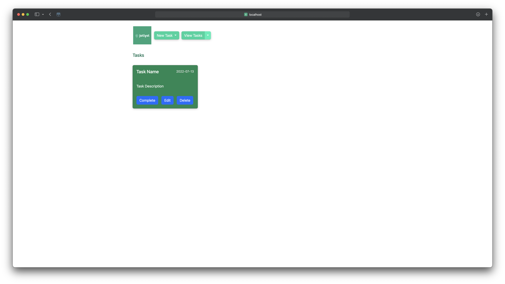
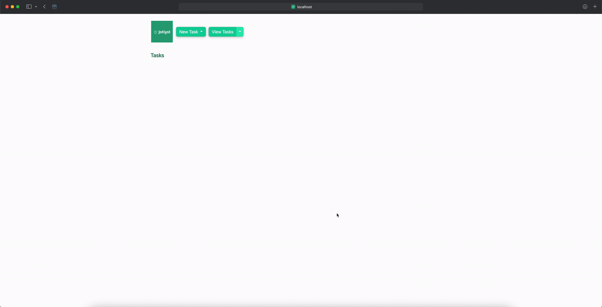
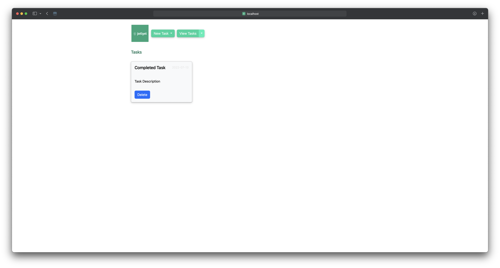

# Jotlyst Milestone 2

## **User Data Interactions**

### **Data**
- **Title**: The title of the task
- **Description**: The description of the task
- **Due Date**: The due date of the task
- **Priority**: The priority of the task
- **Completed**: Whether or not the task is completed

### **Features**
- **Add Task**: Allows users to add a task to the to-do list
- **Edit Task**: Allows users to edit a task in the to-do list
- **Complete Task**: Allows users to complete a task in the to-do list
- **Delete Task**: Allows users to delete a task from the to-do list
- **View Tasks**: Allows users to view all tasks in the to-do list
- **View Tasks by Priority**: Allows users to view tasks by priority *(low, medium, high)*
- **View Tasks by Completed**: Allows users to view tasks by completed

## **User Interface Details**

### **Task Overview**

*Note:* The example task is represented by the singular task shown in the UI.
- **Tasks**: The list of tasks representing the to-do list displayed in a grid format.
- **Title**: The title of the task *(Example: Task Name)*
- **Description**: The description of the task *(Example: Task Description)*
- **Due Date**: The due date of the task *(Example: 2022-07-13)*
- **Priority**: The priority of the task is represented by a color *(Example: low)*

### **Create Task**

- **Create Task**: The New Task button is a dropdown button with a form in the example shown above. When clicked, the user will be prompted to create a new task including the title, description, priority, and due date. After the user submits the form, the task will be added to the to-do list.

### **Edit Task**

- **Edit Task**: The edit task button is represented by a blue button in the example shown above. When clicked, the user will be prompted to edit the title, description, priority, and due date of the task as shown in the sequence above. 

### **Filter Tasks**

- **Filter Tasks**: The View Tasks button is a split dropdown button with a main button component and a dropdown form component. When the arrow is clicked, the user will be prompted to filter the tasks by priority or completed status. After the user submits the form, the tasks will be filtered by the selected attribute. Alternatively, the user can click the "View Tasks" portion of the button to view all tasks.

### **Complete Task**

- **Completed**: The task is represented by a greyed-out background in the example task shown above. Completed tasks have no priority and can only be deleted by the delete button.

### **Front-End Video Demonstration** 

- **Video**: The video demonstration of the Jotlyst UI is shown above.