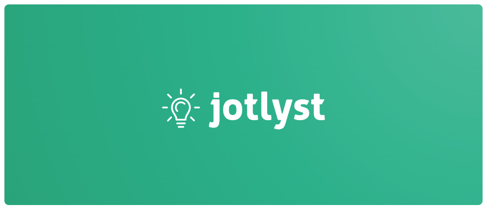

# Jotlyst Milestone 2

## **User Data Interactions**

### **Data**
- **Title**: The title of the task
- **Description**: The description of the task
- **Due Date**: The due date of the task
- **Priority**: The priority of the task
- **Completed**: Whether or not the task is completed

### **Features**
- **Add Task**: Allows users to add a task to the to-do list
- **Edit Task**: Allows users to edit a task in the to-do list
- **Complete Task**: Allows users to complete a task in the to-do list
- **Delete Task**: Allows users to delete a task from the to-do list
- **View Tasks**: Allows users to view all tasks in the to-do list
- **View Tasks by Priority**: Allows users to view tasks by priority *(low, medium, high)*
- **View Tasks by Completed**: Allows users to view tasks by completed

## **Video**

### **Front-End Demonstration** 
